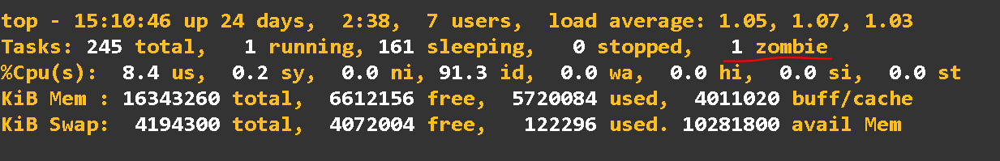

[:arrow_left: Voltar](../README.md)
# 10)

Achar processos zumbi

```ps aux | awk '{ print $8 " " $2 }' | grep -w Z```

Todos processos zumbi ficam com status 'Z', tambem pode verificar a quantide de processos zumbis com o comando `top`, no topo da interface aparecem a contagem de processos zumbis:



Em seguida deve ser executado o comando ```kill -9 PID```, PID do processo.

Caso o processo não seja morto, deve procurar o processo pai que gerou o processo zumbi, com o comando 

```ps -f PID``` - PID do processo


Executando o comando kill neste processo o zumbi será encerrado.


# 11)

Os comandos ```ps -e``` ou ```ps -A``` listam todos os processo do sistema, usando ```grep node``` no resultado do ps usando o pipe ```|```  filtra todos os processos node do sistema.

```ps -e | grep node``` ou ```ps -A | grep node```

Dessa forma todos os procesoss node serão listados.

# 12)

Pelo meu conhecimento atual, não sei como realizar um crontab com essa especifição em um unico comando. Adoraria aprender!!
Atualmente eu executaria essa tarefa da seguinte forma:

Toda Sexta as 10 da manha
```0 10 * * 5  /usr/local/foo-bar.sh```

Toda Sexta as 22:22
```22 22 * * 5  /usr/local/foo-bar.sh```

# 13)

Criei arquivos para rodar a primeira tarefa em docker, subindo com um postgres.

Os Arquivos estão na pasta [:open_file_folder: DockerFiles](../DockerFiles)

